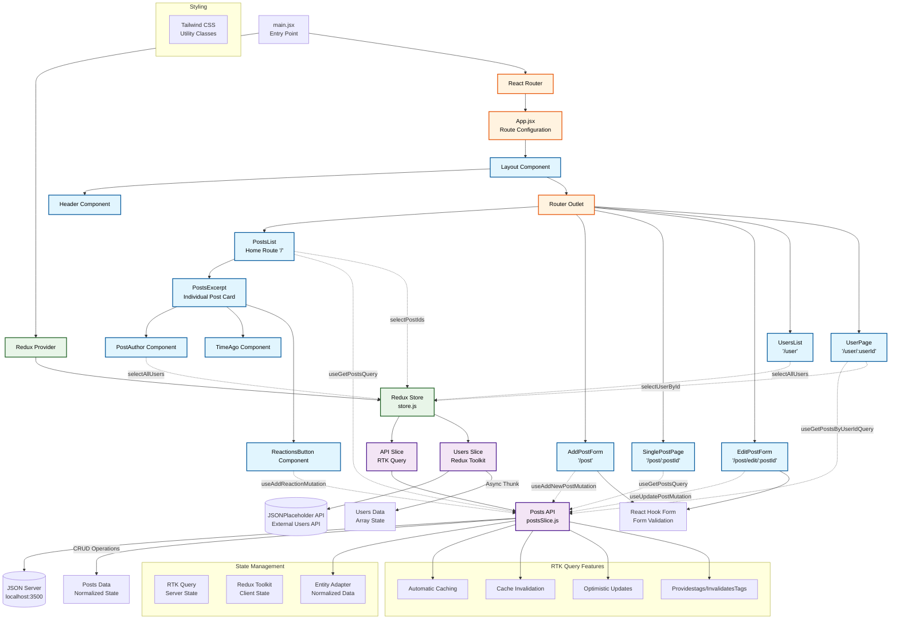

# React Redux RTK Query CRUD App - Architecture Diagram

## Architecture Overview

### Key Components:
- **Entry Point**: main.jsx with Redux Provider and React Router setup
- **State Management**: Redux Toolkit with RTK Query for server state
- **Routing**: React Router with nested routes and layout components
- **API Layer**: RTK Query for posts, Redux Toolkit for users

### Features:
- CRUD Operations for posts
- Normalized state with Entity Adapter
- Automatic caching and invalidation
- Optimistic updates for reactions
- Form validation with React Hook Form
- Tailwind CSS styling