# React Redux RTK Query CRUD App - Class Diagram

```mermaid
%%{wrap}%%
%%{init: {'class': {'htmlLabels': true}}}%%
classDiagram
    %% Store and State Management
    class ReduxStore {
        +api: ApiSlice
        +users: UsersState
        +dispatch(action)
        +getState()
    }

    class ApiSlice {
        +reducerPath: string
        +baseQuery: fetchBaseQuery
        +tagTypes: string[]
        +endpoints: object
        +middleware: function
    }

    class PostsSlice {
        +getPosts(): Query
        +getPostsByUserId(userId): Query
        +addNewPost(post): Mutation
        +updatePost(post): Mutation
        +deletePost(id): Mutation
        +addReaction(postId, reactions): Mutation
        +selectAllPosts(): Selector
        +selectPostById(id): Selector
    }

    class UsersSlice {
        +initialState: User[]
        +fetchUsers(): AsyncThunk
        +selectAllUsers(): Selector
        +selectUserById(id): Selector
    }

    class EntityAdapter {
        +getInitialState(): EntityState
        +setAll(state, entities): EntityState
        +addOne(state, entity): EntityState
        +updateOne(state, update): EntityState
        +removeOne(state, id): EntityState
        +getSelectors(): Selectors
    }

    %% Data Models
    class Post {
        +id: string
        +title: string
        +body: string
        +userId: number
        +date: string
        +reactions: Reactions
    }

    class User {
        +id: number
        +name: string
        +username: string
        +email: string
        +address: Address
        +phone: string
        +website: string
        +company: Company
    }

    class Reactions {
        +thumbsUp: number
        +wow: number
        +heart: number
        +rocket: number
        +coffee: number
    }

    %% Components
    class App {
        +render(): JSX.Element
    }

    class Layout {
        +render(): JSX.Element
    }

    class Header {
        +render(): JSX.Element
    }

    class PostsList {
        +useGetPostsQuery(): QueryResult
        +useSelector(selectPostIds): string[]
        +render(): JSX.Element
    }

    class PostsExcerpt {
        +postId: string
        +useSelector(selectPostById): Post
        +render(): JSX.Element
    }

    class AddPostForm {
        +useAddNewPostMutation(): MutationHook
        +useForm(): FormHook
        +useSelector(selectAllUsers): User[]
        +onSavePostClicked(data): void
        +render(): JSX.Element
    }

    class EditPostForm {
        +useUpdatePostMutation(): MutationHook
        +useSelector(selectPostById): Post
        +useForm(): FormHook
        +onSavePostClicked(data): void
        +render(): JSX.Element
    }

    class SinglePostPage {
        +useSelector(selectPostById): Post
        +useNavigate(): NavigateFunction
        +render(): JSX.Element
    }

    class ReactionsButton {
        +post: Post
        +useAddReactionMutation(): MutationHook
        +reactionClicked(name): void
        +render(): JSX.Element
    }

    class PostAuthor {
        +userId: number
        +useSelector(selectUserById): User
        +render(): JSX.Element
    }

    class TimeAgo {
        +timestamp: string
        +render(): JSX.Element
    }

    class UsersList {
        +useSelector(selectAllUsers): User[]
        +render(): JSX.Element
    }

    class UserPage {
        +useGetPostsByUserIdQuery(userId): QueryResult
        +useSelector(selectUserById): User
        +render(): JSX.Element
    }

    %% Hooks and Utilities
    class RTKQueryHooks {
        +useGetPostsQuery(): QueryResult
        +useGetPostsByUserIdQuery(userId): QueryResult
        +useAddNewPostMutation(): MutationResult
        +useUpdatePostMutation(): MutationResult
        +useDeletePostMutation(): MutationResult
        +useAddReactionMutation(): MutationResult
    }

    class ReactHookForm {
        +useForm(config): FormMethods
        +register(name, rules): RegisterReturn
        +handleSubmit(callback): SubmitHandler
        +formState: FormState
        +reset(): void
    }

    class ReactRouter {
        +useNavigate(): NavigateFunction
        +useParams(): Params
        +Routes: Component
        +Route: Component
        +Outlet: Component
    }

    %% Relationships
    ReduxStore *-- ApiSlice
    ReduxStore *-- UsersSlice
    ApiSlice <|-- PostsSlice
    PostsSlice --> EntityAdapter
    
    Post *-- Reactions
    
    App --> Layout
    Layout --> Header
    Layout --> PostsList
    Layout --> AddPostForm
    Layout --> EditPostForm
    Layout --> SinglePostPage
    Layout --> UsersList
    Layout --> UserPage
    
    PostsList "1" --> "*" PostsExcerpt
    PostsExcerpt --> PostAuthor
    PostsExcerpt --> TimeAgo
    PostsExcerpt --> ReactionsButton
    
    PostsList --> RTKQueryHooks
    AddPostForm --> RTKQueryHooks
    EditPostForm --> RTKQueryHooks
    ReactionsButton --> RTKQueryHooks
    UserPage --> RTKQueryHooks
    
    AddPostForm --> ReactHookForm
    EditPostForm --> ReactHookForm
    
    PostsList --> ReduxStore
    PostsExcerpt --> ReduxStore
    PostAuthor --> ReduxStore
    UsersList --> ReduxStore
    UserPage --> ReduxStore
    
    App --> ReactRouter
    SinglePostPage --> ReactRouter
    AddPostForm --> ReactRouter
    EditPostForm --> ReactRouter

    %% Styling
    classDef store fill:#e8f5e8,stroke:#1b5e20,stroke-width:3px,color:#000000,font-size:16px
    classDef component fill:#e1f5fe,stroke:#01579b,stroke-width:3px,color:#000000,font-size:16px
    classDef model fill:#fff3e0,stroke:#e65100,stroke-width:3px,color:#000000,font-size:16px
    classDef utility fill:#f3e5f5,stroke:#4a148c,stroke-width:3px,color:#000000,font-size:16px

    class ReduxStore store
    class ApiSlice store
    class PostsSlice store
    class UsersSlice store
    class EntityAdapter store
    class App component
    class Layout component
    class Header component
    class PostsList component
    class PostsExcerpt component
    class AddPostForm component
    class EditPostForm component
    class SinglePostPage component
    class ReactionsButton component
    class PostAuthor component
    class TimeAgo component
    class UsersList component
    class UserPage component
    class Post model
    class User model
    class Reactions model
    class RTKQueryHooks utility
    class ReactHookForm utility
    class ReactRouter utility
```

## Class Diagram Overview

### Store Layer:
- **ReduxStore**: Central state container
- **ApiSlice**: RTK Query API configuration
- **PostsSlice**: Posts-specific API endpoints and selectors
- **UsersSlice**: Users state management
- **EntityAdapter**: Normalized state management

### Data Models:
- **Post**: Blog post entity with reactions
- **User**: User entity from external API
- **Reactions**: Post reaction counts

### Component Layer:
- **Layout Components**: App structure and routing
- **Post Components**: CRUD operations for posts
- **User Components**: User-related displays
- **Utility Components**: Reusable UI elements

### Utilities:
- **RTK Query Hooks**: Data fetching and mutations
- **React Hook Form**: Form validation and handling
- **React Router**: Navigation and routing