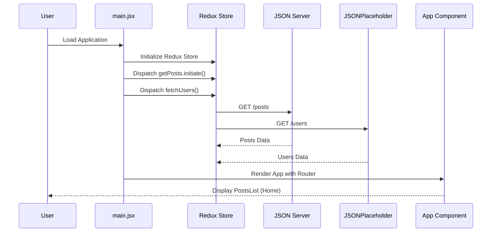
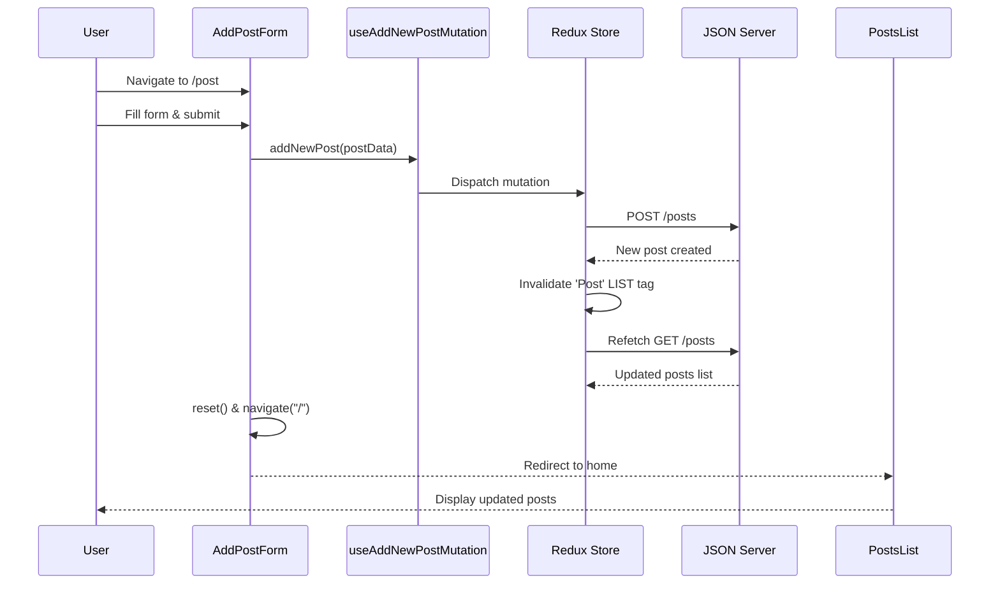
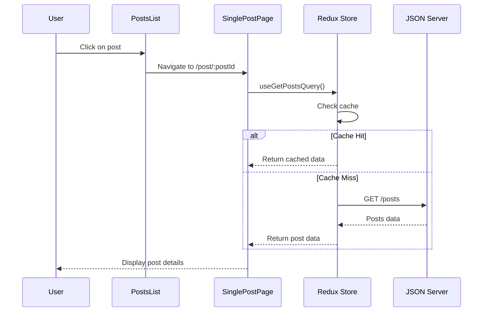
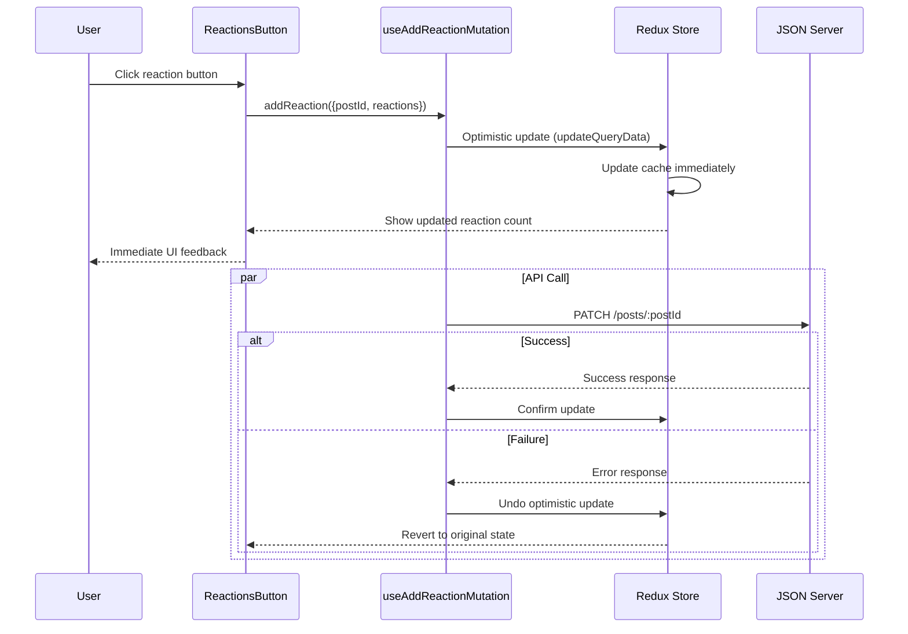
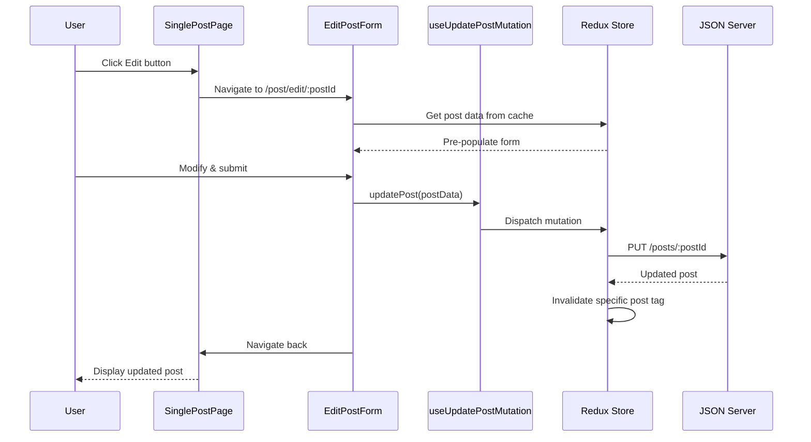
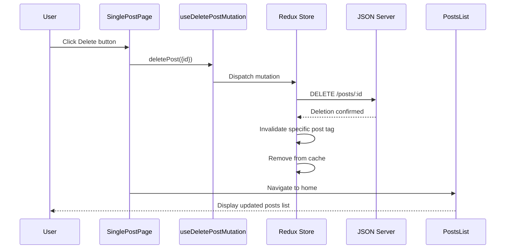
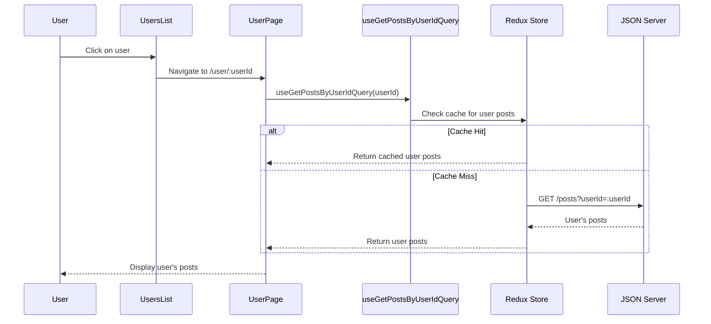

# React Redux RTK Query CRUD App - Sequence Diagrams

## Application Initialization

## Create New Post Flow

## View Single Post Flow

## Add Reaction Flow (Optimistic Update)

## Edit Post Flow

## Delete Post Flow

## User Posts View Flow

